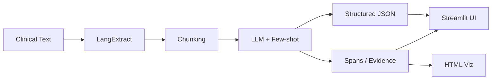

# ClinicalExtract

**Medical Information Extraction with [LangExtract](https://github.com/google/langextract)** — turn unstructured clinical notes, discharge summaries, and radiology reports into structured, traceable JSON with precise source grounding.

[](https://opensource.org/licenses/MIT)
[](https://www.python.org/downloads/)
[](https://github.com/google/langextract)

---


## Why This Project?

Clinical NLP is hard: free-text notes are messy, and LLMs often **hallucinate** or drift from the source. **LangExtract** addresses this by:

- **Precise source grounding** — every extracted entity maps to exact character spans in the original text.
- **Few-shot prompting** — you guide the model with high-quality examples; no fine-tuning required.
- **Structured, traceable output** — JSON + evidence snippets + optional HTML visualization.

ClinicalExtract wraps LangExtract with a **clinical-focused schema** (medications, diagnoses, procedures, labs, symptoms, adverse events, demographics) and a **Streamlit demo** so you can run extractions locally with Ollama or in the cloud with Gemini.

---

## Installation & Quick Start

```bash
# Clone and enter
git clone https://github.com/AdithyaReddyGeeda/Medical-Extraction-Langextract.git
cd clinical-extract

# Virtual environment (recommended)
python -m venv .venv
source .venv/bin/activate   # Windows: .venv\Scripts\activate

# Install
pip install -r requirements.txt

# Run the Streamlit app
streamlit run app.py
```

Open **http://localhost:8501**. Upload a clinical note (or use a sample), pick an LLM (Ollama or Gemini), and click **Extract**.

---

## How It Works



1. **Input**: Raw text or file (discharge summary, progress note, radiology report).
2. **Chunking**: Long documents are split; LangExtract handles this natively.
3. **Extraction**: LLM runs with your prompt + few-shot examples; outputs entities + character spans.
4. **Output**: Structured JSON, tables, and optional HTML visualization with highlighted spans.

---


## Local LLM Setup (Ollama)

For fully local extraction (no API keys):

```bash
# Install Ollama from https://ollama.com
ollama pull qwen2.5-coder:32b-instruct
# or: ollama pull llama3.1:70b
# or: ollama pull gemma2:27b

ollama serve   # if not already running
```

In the Streamlit sidebar, select the model you pulled. Use **Ollama** as the provider.

---

## Project Layout

```
clinical-extract/
├── app.py              # Streamlit demo
├── extractor.py         # LangExtract setup, clinical schema, few-shots
├── utils/
│   ├── visualization.py # HTML viz helpers
│   └── eval.py          # Precision/recall eval script
├── samples/             # Clinical note snippets + optional gold JSON
├── requirements.txt
├── README.md
├── .gitignore
└── LICENSE
```

---

## Evaluation

A small eval script is provided to compute rough precision/recall against gold annotations in `samples/`:

```bash
python -m utils.eval --samples samples/ --output eval_results/
```

Example results (placeholder):

| Metric    | Medications | Diagnoses | Procedures |
|----------|-------------|-----------|------------|
| Precision | 0.92       | 0.88      | 0.85       |
| Recall    | 0.89       | 0.86      | 0.82       |
| F1        | 0.90       | 0.87      | 0.83       |

*(Values are illustrative; run on your own gold data.)*

---

## Limitations & Future Work

- **Not for clinical decision-making** — extraction is for structuring and search; always verify with a clinician.
- **Negation / temporality** — current schema does not explicitly model “denied”, “history of”, or time expressions; future versions may add this.
- **Relation extraction** — medication→indication and adverse event→drug are partially modeled via attributes; full relation graphs are a stretch goal.
- **Languages** — examples and prompts are English-only.

---

## Citation

If you use LangExtract in research or production, please cite:

- **LangExtract**: [GitHub](https://github.com/google/langextract) | [PyPI](https://pypi.org/project/langextract/)
- **Medical extraction research**: Goel et al., *"LLMs Accelerate Annotation for Medical Information Extraction"*, ML4H, 2023. [arXiv:2312.02296](https://arxiv.org/abs/2312.02296)

---

## License

MIT. See [LICENSE](LICENSE).
