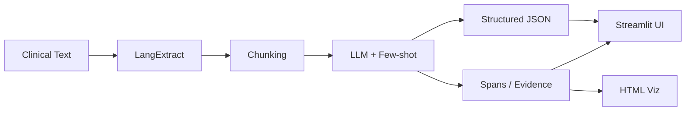

# ClinicalExtract

**Medical Information Extraction with [LangExtract](https://github.com/google/langextract)** — turn unstructured clinical notes, discharge summaries, and radiology reports into structured, traceable JSON with precise source grounding.

[](https://opensource.org/licenses/MIT)
[](https://www.python.org/downloads/)
[](https://github.com/google/langextract)

---

## Why This Project?

Clinical NLP is hard: free-text notes are messy, and LLMs often **hallucinate** or drift from the source. **LangExtract** addresses this by:

- **Precise source grounding** — every extracted entity maps to exact character spans in the original text.
- **Few-shot prompting** — you guide the model with high-quality examples; no fine-tuning required.
- **Structured, traceable output** — JSON + evidence snippets + optional HTML visualization.

ClinicalExtract wraps LangExtract with a **clinical-focused schema** (medications, diagnoses, procedures, labs, symptoms, adverse events, demographics) and a **Streamlit** app. You can run **Ollama** locally or use **Gemini**, **OpenAI**, or **Anthropic** in the cloud.

---

## Features

| Area | Description |
|------|-------------|
| **Providers** | Ollama (local), Gemini, OpenAI GPT-4o / GPT-4o-mini, Anthropic Claude |
| **Input** | Paste text, single **.txt / .pdf / .docx**, **batch** multi-file upload, or built-in samples |
| **Caching** | Repeated extractions with the same settings are cached (`@st.cache_data`) to avoid redundant LLM calls |
| **Evidence** | Grouped view by `medication_group` / `lab_group` plus ungrouped “Other” |
| **History** | Sidebar keeps recent single-note runs (re-download JSON); batch runs are not stored |
| **Evaluation** | `evaluate.py` runs extraction against gold JSON and writes `eval_results/eval_results.json` |

---

## Installation & Quick Start

```bash
git clone https://github.com/AdithyaReddyGeeda/Medical-Extraction-Langextract.git
cd Medical-Extraction-Langextract

python -m venv .venv
source .venv/bin/activate   # Windows: .venv\Scripts\activate

pip install -r requirements.txt

# Optional: copy .env.example to .env and add API keys
cp .env.example .env

streamlit run app.py
```

Open **http://localhost:8501**. Choose input mode, pick a provider and model in the sidebar, then **Extract** (or **Extract All** in batch mode).

---

## Environment variables

Set keys in `.env` or your shell (see `.env.example`):

| Variable | Used for |
|----------|----------|
| `LANGEXTRACT_API_KEY` | Gemini (LangExtract) |
| `OPENAI_API_KEY` | OpenAI |
| `ANTHROPIC_API_KEY` | Anthropic |

Ollama does not require API keys; ensure the server is running (e.g. `ollama serve`) and models are pulled.

---

## How It Works


```mermaid
flowchart LR
    A[Clinical Text] --> B[LangExtract]
    B --> C[Chunking]
    C --> D[LLM + Few-shot]
    D --> E[Structured JSON]
    D --> F[Spans / Evidence]
    E --> G[Streamlit UI]
    F --> G
    F --> H[HTML Viz]
```

1. **Input**: Raw text or file (discharge summary, progress note, radiology report).
2. **Chunking**: Long documents are split; LangExtract handles this natively.
3. **Extraction**: LLM runs with your prompt + few-shot examples; outputs entities + character spans.
4. **Output**: Structured JSON, tables, optional HTML visualization, and grouped evidence.

---

## Local LLM (Ollama)

```bash
# Install Ollama from https://ollama.com
ollama pull qwen2.5-coder:32b-instruct
# or: ollama pull llama3.1:70b
# or: ollama pull gemma2:27b

ollama serve   # if not already running
```

In the app sidebar, choose **Ollama (local)** and the model you pulled.

---

## Evaluation

Place a gold label file next to each sample note: for `samples/note.txt`, add `samples/note.json` (list of extractions with `class` and `text`).

Run the full pipeline (extracts, writes `*_pred.json`, scores):

```bash
python evaluate.py --provider gemini --model gemini-2.5-flash
```

Useful flags:

| Flag | Default | Meaning |
|------|---------|--------|
| `--samples` | `samples/` | Directory of `.txt` files |
| `--output` | `eval_results/` | Where `eval_results.json` is written |
| `--provider` | `gemini` | `gemini`, `openai`, `anthropic`, `ollama` |
| `--model` | `gemini-2.5-flash` | Model id |
| `--match` | `partial` | `partial` or `exact` span matching |
| `--skip-extraction` | off | Score existing `*_pred.json` only |

The report includes per-file aggregate metrics, overall aggregate, and a **per-class** precision / recall / F1 breakdown. You can also use `python -m utils.eval` for a lighter path that only reads existing predictions.

---

## Project layout

```
.
├── app.py                 # Streamlit UI
├── evaluate.py            # CLI evaluation (runs extractor + metrics)
├── extractor.py           # LangExtract wiring, clinical schema, few-shots
├── utils/
│   ├── visualization.py # HTML viz helpers
│   └── eval.py            # Metrics, load_gold, per-class evaluation
├── samples/               # .txt snippets + optional matching .json gold
├── requirements.txt
├── .env.example
├── README.md
├── UPGRADE.md
├── .gitignore
└── LICENSE
```

---

## Limitations & future work

- **Not for clinical decision-making** — extraction is for structuring and search; always verify with a clinician.
- **Negation / temporality** — the schema does not fully model “denied”, “history of”, or time expressions everywhere.
- **Relation extraction** — medication→indication and similar links are partially modeled via attributes; full relation graphs are a stretch goal.
- **Languages** — examples and prompts are English-only.

---

## Citation

If you use LangExtract in research or production, please cite:

- **LangExtract**: [GitHub](https://github.com/google/langextract) | [PyPI](https://pypi.org/project/langextract/)
- **Medical extraction research**: Goel et al., *"LLMs Accelerate Annotation for Medical Information Extraction"*, ML4H, 2023. [arXiv:2312.02296](https://arxiv.org/abs/2312.02296)

---

## Upgrade notes

For dependency bumps, schema improvements, and production options, see **[UPGRADE.md](UPGRADE.md)**.

---

## License

MIT. See [LICENSE](LICENSE).
